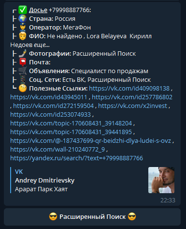

<a href="https://www.youtube.com/c/DimonDev?sub_confirmation=1"></a> [](https://probivapi.com)
<h1 align="center"><b>Глаз Бога</b></h1>
<p align="center">Это моя версия телеграм бота Глаз Бога. Работает прекрасно, стабильно и выдает много информации:</p>
<p align="center">Сделан программистом DimonDev: https://youtube.com/dimondev</p>
<h1 align="center"><a href="https://probivapi.com"> > Попробовать API < </a></h1>
<h3 align="center"></h3>
<h1 align="center"><b>Установка</b></h1>
<p>Он устанавливается очень просто:</p>

```
git clone https://github.com/SegYT/glazboga
cd glazboga
pip install -r requirements.txt
```
<p>Теперь запускаем скрипт:</p>

```
python main.py
```

<p>Если ты сделал все правильно, то программа должна написать:</p>

```
!BOT STARTED!
```
